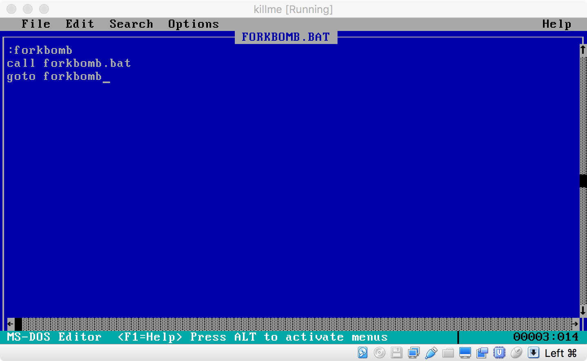
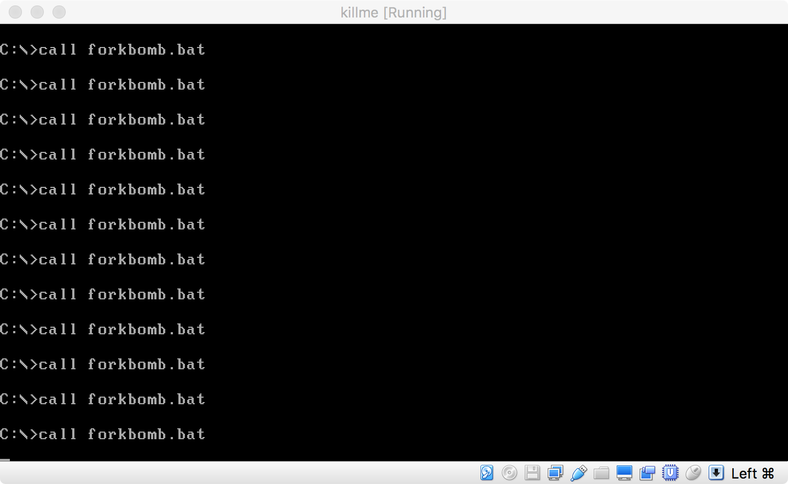

## `forkbomb.py`

To run: `python forkbomb.py`
Crashes: Ubuntu 16.04

This Python program indefinitely creates a running process that creates
another running process (`fork`).

## `forkbomb.bat`

To run (on MS-DOS): `call forkbomb.bat`
Crashes: MS-DOS

This DOS Batch File does something similar as `forkbomb.py`, as it
calls itself.

## `forkbomb.sh`

To run: `bash forkbomb.sh`
Crashes: Ubuntu 16.04

This Bash script does a similar thing to `forkbomb.py`, as it
also calls itself.

